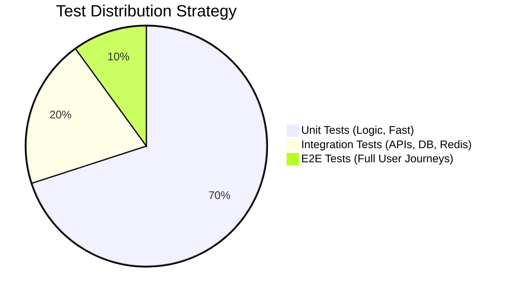

# Ladeway 2.0 — Testing Pyramid Strategy

**Date:** 2026-08-11
**Objective:** Define the boundaries of unit, integration, and E2E tests for the Ladeway 2.0 rebuild, mapping exactly what gets tested where.

## 1. The Testing Pyramid

Our testing strategy follows a standard pyramid to maximize confidence while minimizing test runtime and flakiness.

### 1.1 Unit Tests (70%)
**Goal:** Test pure business logic, pure functions, and isolated services without any network or database dependencies.
**Tools:** Jest
**Targets:**
- `QualificationEngineService`: All state machine transitions (Escalation, Extraction threshold, Completion).
- `ScoringService`: Evaluating scoring rules against extracted JSON.
- `PromptService`: Assembling string templates without conditionals.
- `ExtractorService`: JSON parsing, markdown-stripping, and error recovery logic.
- `LLMRouterService`: Backoff logic and chunk buffering (mocking the actual fetch call).

### 1.2 Integration Tests (20%)
**Goal:** Verify that components work together correctly, particularly focusing on database state (Postgres via Prisma) and ephemeral state (Redis).
**Tools:** Jest + Supertest + Isolated Test Database (`ladeway_test`)
**Targets:**
- `TenantMiddleware` & `AuthGuard`: Prove cross-tenant isolation works at the API boundary.
- `IndustryConfigService`: Prove caching layer (in-memory/Redis) and CRUD API works.
- `SessionService`: Prove Redis keys are written with correct TTLs.
- `ConversationController`: Hit the API and verify DB insertion/session creation without triggering actual LLMs (mocking the `LLMRouterService`).

### 1.3 End-to-End (E2E) Tests (10%)
**Goal:** Verify critical business paths from the user's perspective, running the full stack locally (Frontend + Backend + Database + Redis).
**Tools:** Playwright
**Targets:** The 5 Critical User Journeys (see below).

## 2. The 5 Critical User Journeys (E2E)

These are the paths that, if broken, represent a catastrophic failure for the business. They must be covered by Playwright against a running instance before any deployment to production.

1. **The Qualification Loop (Happy Path)**
   - User opens the chat widget for a tenant.
   - User answers 3-4 questions sequentially.
   - Conversation closes successfully; a Lead is verified in the dashboard.
2. **The Escalation Path (Human Handoff)**
   - User triggers an escalation phrase ("speak to a human").
   - System immediately transfers the chat without hallucinating.
   - A Lead marked `TRANSFERRED` appears in the dashboard.
3. **The Multi-Tenant Boundary (Security)**
   - Log in as Tenant A (Logistics).
   - Attempt to access Tenant B's (Real Estate) dashboard or config via UI manipulation or direct URL access.
   - Confirm access is denied and data is invisible.
4. **The Billing & Onboarding Flow**
   - New user signs up and completes Stripe Checkout (test mode).
   - User lands in a provisioned dashboard with an active subscription limit.
5. **The Abandonment & Partial Capture Recovery**
   - User answers 2 questions and closes the tab.
   - Trigger the abandonment cron job manually.
   - Verify a partial Lead is generated and the session is cleared.

## 3. Next Steps

- **Phase 3**: Set up the isolated Postgres test database and configure Jest for integration testing.
- **Phase 4**: Set up Playwright for E2E tests and write the first smoke test.
- **Phase 5-8**: Backfill the missing unit test coverage identified in the Phase 1 Technical Debt Audit.
